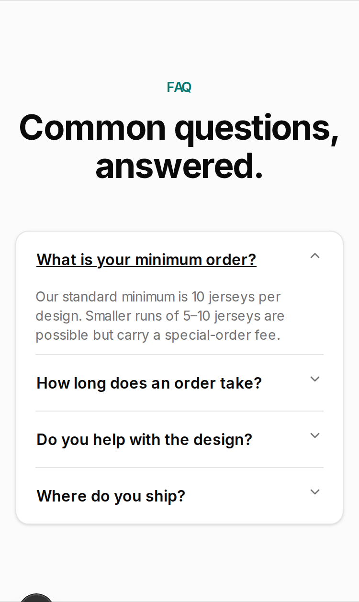

# 0001 FAQ: answer repeat customer questions (UX)

Register: `~/sidestep/initiatives/0001-repeated-customer-answers/initiative.md`
Mockup: `docs/ux/0001-faq/mockup.html` (see "How to view the mockup" below)

## TL;DR

- **One answer list, two outlets.** JCC edits each answer once. The site FAQ and
  JCC's replies are both generated from that list, so they can't drift apart.
- **Copy buttons live on the public FAQ, inside each open answer:**
  `Copy answer` (plain text + a link to that answer) and `Copy link` (link only).
  There's no admin screen and no sign-in, and it works from JCC's phone.
- **Journey B takes about 30 seconds:** open the FAQ, tap the question, tap
  Copy answer, paste, send. That's inside the one-minute target.
- **8 questions** cover the 6 in `done_when` plus the 4 already live (two overlap).
  3 are fully STABLE. 5 still have NEEDS JCC facts. The biggest one: **the site
  contradicts itself on the minimum order** (see Q2).

---

## 1. Problem and who it's for

> "All recurring pre-sales questions (lead time, order cost, minimum order
> quantity, design tips, the design process, screen-vs-print colour matching) can
> be answered from one place I edit, and sending an answer to a customer takes
> under a minute with no retyping." (register 0001, `done_when`)

The same handful of pre-sales questions keep arriving, and JCC answers each one
from scratch. The wording drifts between customers, and the best phrasing gets
lost in old threads. Two people need this fixed:

- **Visitor / captain**: on a phone, sizing up Sidestep. They want the answer
  without having to message and wait.
- **JCC**: answering a DM or email at 10pm. He wants to send a good answer
  without typing it again.

Two concerns, kept separate throughout this doc:

```
            ┌──────────────────────────────┐
  JCC ────► │ 1. ANSWER SOURCE (internal)  │  one entry per question, edited once
  edits     │  id · question · answer ·    │
  once      │  order · published?          │
            └──────────────┬───────────────┘
                           │ rendered by
          ┌────────────────┴─────────────────┐
          ▼                                  ▼
 ┌──────────────────────┐        ┌──────────────────────────────┐
 │ 2a. SITE FAQ         │        │ 2b. SEND ONE ANSWER          │
 │ sidestep.design/#faq │        │ "Copy answer" → text + link  │
 │ captain self-serves  │        │ "Copy link"   → link only    │
 └──────────────────────┘        │ JCC pastes into chat/email   │
                                 └──────────────────────────────┘
```

## 2. What exists today



- `components/marketing/FaqSection.tsx`: 4 hardcoded Q&As in a shadcn
  `Accordion` inside `<section id="faq">` on the landing page (`app/page.tsx`),
  wrapped in `<Reveal>`. The accordion items have no ids of their own, so you
  can't link to one answer. There's no copy action anywhere.
- `components/layout/MarketingNav.tsx`: the nav links are Customize, Process and
  Pricing. **FAQ isn't in the nav.** You have to scroll to find it.
- `lib/pricing.ts` + `PricingSection` / `PricingCalculator`: tiers of $60 (5–9),
  $50 (10–24), $45 (25–49) and $40 (50+), plus a flat $125 design fee.
  The calculator says: "Estimated cost — final quote confirmed by Sidestep."
- `ProcessSection.tsx`: Design Template → 3D Mock-up → Production (about 4 weeks).
- `components/admin/CopyInviteLinkButton.tsx`: an existing copy-to-clipboard
  button (outline `Button`, `Copied!` state, sonner toast, and a fallback that
  shows the text if the clipboard is blocked). **Reuse this pattern.**
- `IntakeForm.tsx` already has a "Questions or concerns" field, so "ask us on
  the quote form" is a real path.
- The claim "20+ years of industry experience" appears twice: in the FAQ design
  answer and in `HeroSection.tsx`. **NEEDS JCC** (D8).

**Contradiction found:** the live FAQ says *"standard minimum is 10 … 5–10 carry
a special-order fee"*, backlog 2-01 says *"10, or 5 with surcharge"*, and the
pricing section says *"Orders start at 5 jerseys"* at $60 each with no separate
fee. A captain who reads both sections gets two different answers. (D1)

## 3. The question list

Legend: **STABLE** means every fact is already on the site or in a spec (source
cited). **NEEDS JCC** means at least one fact is unconfirmed; the gap is marked
`[CONFIRM: …]` and listed in section 7. All wording is a draft, because JCC
signs off customer-facing copy (D11).

The 6 `done_when` topics plus the 4 existing Q&As come to 8 entries: MOQ and lead
time were already live. The `id` is the permanent deep-link slug and must never
change once published.

| # | id | Question | done_when | Existing | Flag |
|---|---|---|---|---|---|
| 1 | `cost` | How much do custom jerseys cost? | order cost | – | NEEDS JCC |
| 2 | `minimum` | What's the minimum order? | MOQ | yes | NEEDS JCC |
| 3 | `timeline` | How long does an order take? | lead time | yes | NEEDS JCC |
| 4 | `process` | How does the process work? | design process | – | NEEDS JCC |
| 5 | `design` | Do you help with the design? | – | yes | NEEDS JCC |
| 6 | `design-tips` | Any tips for designing our jerseys? | design tips | – | NEEDS JCC |
| 7 | `colour` | Will the colours match what I see on screen? | colour matching | – | NEEDS JCC |
| 8 | `shipping` | Where do you ship? | – | yes | STABLE |

The order follows the questions people ask first: price, then minimum, then time.

Where a `[CONFIRM]` sits inside a sentence, the sentence ships only once JCC
fills or deletes it. Where it sits on its own line, JCC can simply delete it.

### Q1 · `cost` · How much do custom jerseys cost? · NEEDS JCC

> Jerseys are $40 to $60 each. The more you order, the less each one costs:
> $60 each for 5–9, $50 for 10–24, $45 for 25–49 and $40 for 50 or more.
>
> Want us to design it for you? That's a flat $125 design fee. The
> [price calculator](/#pricing) works out your total, and we confirm your final
> quote before anything is made.
>
> [CONFIRM: Are tax and delivery included in these prices, or extra?]

Sources: tiers and fee from `lib/pricing.ts`; "final quote confirmed" from
`PricingCalculator.tsx`. **Rule for the build:** the numbers must be generated
from `lib/pricing.ts`, not typed in, so this answer can never disagree with the
calculator. That's the one exception to "JCC edits the text". The mockup
does it this way. Open question: D2.

### Q2 · `minimum` · What's the minimum order? · NEEDS JCC

Draft, assuming D1 = A (min 5, and the $60 tier *is* the small-run price):

> 5 jerseys per design. Small runs cost more to set up, so 5–9 jerseys are $60
> each. From 10 jerseys the price drops to $50 each.

Sources: `lib/pricing.ts` (`MIN_ORDER_QUANTITY = 5`, tiers). This conflicts with
the live FAQ and backlog 2-01, and "small runs cost more to set up" is my
explanation, not a known fact. If D1 = B, the answer becomes: "Our standard
minimum is 10 jerseys per design. We can do 5–9 for an extra [CONFIRM: fee]."
**This must not ship until D1 is decided.**

### Q3 · `timeline` · How long does an order take? · NEEDS JCC

> Most orders take around 4 weeks from the day you approve your design to
> delivery. The design back-and-forth comes before that, so get in touch early.
>
> Playing against a season start or a tournament? Put your date on the
> [quote form](/intake) and we'll tell you up front if it's tight.
>
> [CONFIRM: Do you offer rush orders? If yes, how fast and what does it cost?]

Sources: "around 4 weeks from confirmed design to delivery" and "we'll flag a
tighter timeline up front" from the live FAQ; "once you're happy with the
mock-up" from `ProcessSection`; the intake form collects a deadline
(`leads` shows a Deadline field). Open question: D3. I also flag this: how long
the design stage usually takes is unknown. If JCC has a typical number ("usually
a week"), it makes this answer much more useful. That's also part of D3.

### Q4 · `process` · How does the process work? · NEEDS JCC

> 1. Get a quote: tell us about your team on our [quote form](/intake).
> 2. Design: add your colours, logos and ideas to our jersey template, or we
>    design it with you.
> 3. 3D mock-up: see exactly how your jersey will look before anything is made.
> 4. Production: once you're happy with the mock-up, most orders arrive in
>    around 4 weeks.
>
> [CONFIRM: Add a step for names/numbers/sizes and for payment? When do they happen?]

Sources: steps 2–4 are `ProcessSection.tsx`; step 1 is the intake form.
The app already has a roster flow (jersey runs, player links), but the site
never tells the customer when that happens or when they pay. Open question: D4.

### Q5 · `design` · Do you help with the design? · NEEDS JCC

> Yes. Send us a rough idea, a mood board or a sketch and we'll build the design
> with you for a flat $125 fee. You'll see a 3D mock-up before anything goes
> into production.
>
> Already have a finished design? Then there's no design fee.
>
> [CONFIRM: How many rounds of changes are included?]

Sources: live FAQ; `$125` and "I don't have my own design — add a flat $125
design fee" from `PricingCalculator.tsx`. I **removed "20+ years of industry
experience"** from this answer. It doesn't answer the question, and it's an
unverified claim (D8). Open question: D5.

### Q6 · `design-tips` · Any tips for designing our jerseys? · NEEDS JCC

> A few things that make a big difference:
> - Send logos as SVG files or the largest PNG you have. Blurry logos print blurry.
> - Make names and numbers stand out hard against the jersey colour so they read
>   from across the field.
> - Skip tiny text and thin lines. They disappear from a distance.
> - Sublimation prints the whole jersey, so full-body patterns and gradients
>   are fair game.
>
> [CONFIRM: JCC to edit or replace these tips. Is there any extra cost for more colours or full-body graphics?]

Sources: SVG/PNG are among the upload types the app accepts
(`lib/designAsset.ts`); "fully sublimated" is in `HeroSection`. The tips
themselves are general sublimation advice, not Sidestep facts. JCC knows which
mistakes customers actually make, so this answer is his to rewrite. Open
question: D6.

### Q7 · `colour` · Will the colours match what I see on screen? · NEEDS JCC

> Close, but not exactly. Screens glow and fabric doesn't, so colours on your
> phone (and on the 3D mock-up) can look a bit different on the finished jersey.
>
> If a colour has to be right, like a club or sponsor colour, send us its
> Pantone code and [CONFIRM: we'll match it as closely as the fabric allows].
>
> [CONFIRM: Can you send a printed colour sample before production? Cost and time?]

Sources: the design palette editor already records a Pantone code per swatch
(`PaletteEditor.tsx`), so asking for Pantone codes fits the app. The matching
promise and any sample offer are policy, and I haven't invented them. Open
question: D7.

### Q8 · `shipping` · Where do you ship? · STABLE

> We currently serve the Greater Vancouver area. If you're outside that region,
> get in touch and we'll see what we can do.

Source: live FAQ, unchanged.

### Section copy (new, small)

- Subtitle under "Common questions, answered.": **"Straight answers to what
  captains ask us most."**
- After the list: **"Didn't see your question?"** plus a teal button **"Get a quote
  and ask us"** → `/intake` (it has a "Questions or concerns" field).
- Nav: add **FAQ** → `/#faq` after Pricing in `MarketingNav` (desktop and the
  mobile sheet).

## 4. Journeys

### Journey A: captain self-serves on the site FAQ

```
TRIGGER  Captain Sam, phone, 10pm: "how much would jerseys even cost us?"
   │     arrives from Instagram bio / Google / a link JCC sent
   ▼
[1] Landing page ─ taps "FAQ" in the nav (new) ──────────► #faq section
   │                                   (or arrives on a deep link, see A')
   ▼
[2] Scans 8 questions; the first one is already about price
   ▼
[3] Taps "How much do custom jerseys cost?" → answer opens in place
   │
   ├─ wants their number ─► taps "price calculator" ─► #pricing ─► quote
   ├─ answered, ready    ─► "Get a quote and ask us" ─► /intake
   ├─ wants the team's opinion ─► "Copy link" ─► pastes in team group chat
   └─ still unsure      ─► "Didn't see your question?" ─► /intake (Questions field)
OUTCOME  Sam got the answer without messaging and waiting.

A' DEEP LINK: sidestep.design/#faq-timeline
   page loads → scrolls to FAQ → "How long…" is OPEN, focused, and sits clear of
   the sticky nav → a short teal edge marker shows which one. Unknown id → FAQ
   section with everything closed, and no error.
```

### Journey B: JCC answers a chat or email question in under a minute

This is how `done_when` gets checked. Times are rough estimates for a phone. A
JCC dry run at Gate 2 confirms or corrects them.

```
TRIGGER  DM: "hey! how long do jerseys take? our season starts oct 20"
```

| Step | JCC does | Screen | ~Time |
|---|---|---|---|
| 1 | Reads the message and recognises an FAQ question | chat app | 5 s |
| 2 | Opens `sidestep.design/#faq` from a home-screen bookmark | browser | 5 s |
| 3 | Taps "How long does an order take?" | FAQ | 2 s |
| 4 | Taps **Copy answer**: button flips to "Copied!" and a toast confirms | FAQ | 1 s |
| 5 | Switches back to the chat and long-presses → Paste | chat app | 5 s |
| 6 | *(optional)* Adds a personal line: "Hey Sam! Oct 20 is doable if we lock the design this week." | chat app | 10–15 s |
| 7 | Sends | chat app | 1 s |
| | **Total** | | **≈ 20 s without step 6, ≈ 35 s with it** |

No retyping: the answer text and link are pasted. Step 6 is optional and
personal, not a retype of the answer. Email is the same path, pasting into the
Gmail body.

What gets pasted (the real output of the mockup's Copy answer):

```
Most orders take around 4 weeks from the day you approve your design to
delivery. The design back-and-forth comes before that, so get in touch early.

Playing against a season start or a tournament? Put your date on the quote
form and we'll tell you up front if it's tight.

https://sidestep.design/#faq-timeline
```

Edge path: **the question isn't in the FAQ.** JCC answers by hand as he does today,
and if it comes up a second time he adds it to the answer source. That's outside
the one-minute path, and it's how the list grows.

## 5. The copy action: where it lives and what it copies

### Recommendation: on the public FAQ, inside each open answer, visible to everyone

```
┌───────────────────────────────────────────┐
│ How long does an order take?            ^ │
│ Most orders take around 4 weeks from …    │
│ Playing against a season start or …       │
│                                           │
│ [⧉ Copy answer]  [🔗 Copy link]           │  ← outline buttons, 40px tall
└───────────────────────────────────────────┘
```

**Why the public page:**
- JCC answers from his phone. The public FAQ is one tap from a bookmark, with no
  Clerk sign-in and no admin shell built for desktop.
- There's one rendering of the answers. An admin copy would be a second view of
  the same content, and a second thing to keep right.
- Captains get something useful too: "Copy link" lets them forward an answer to
  their team, which is how rec-league decisions actually get made.
- The buttons only appear inside an *open* answer, so the collapsed list stays
  clean for visitors.

**Rejected: an admin-only "Answers" page in `/admin`.** It means a sign-in on the
phone, an extra nav item and a second view of the content. It only makes sense
later if JCC wants private answers that aren't on the public site.

**Fallback if JCC doesn't want public buttons:** the same buttons, shown only
when signed in as admin on the public FAQ. It costs an auth check on a marketing
page that's static today. Offered as option B in D9.

### What each button copies: both, because the channel is unknown

| Button | Copies | Best for |
|---|---|---|
| **Copy answer** (primary) | Answer as plain text, a blank line, then that answer's deep link | Instagram/FB DMs, SMS, email: the customer gets the answer inline, and the link has the rest |
| **Copy link** | `https://sidestep.design/#faq-<id>` only | Short replies ("here you go: …"), captains sharing with their team |

Plain-text rules for **Copy answer**:
- No formatting, no greeting, no sign-off. JCC adds his own voice.
- Inline links become plain words ("price calculator"). The single URL at the
  end is always that answer's own deep link.
- Numbered lists stay as `1.`; bullets become `•`.
- The origin is read at click time, as in `CopyInviteLinkButton`, so it works on
  preview deploys.

Feedback reuses `CopyInviteLinkButton`: the icon swaps to a check and the label
to "Copied!" for 2 s, with a sonner toast "Answer copied. Paste it into your
message." If the clipboard is blocked, an error toast shows the text or link so
it can be copied by hand.

**Rejected: a separate `/faq/<id>` page per question.** It would give nicer link
previews in chat (the question as the preview title instead of the homepage's).
But it's a new route and a new template, which is more than this pilot needs.
Worth revisiting if JCC finds the homepage preview confusing in real chats.

### The answer source (concern 1): UX requirements only

The architect chooses the mechanism. From the UX side, each entry needs:
- `id`: the permanent slug used in the deep link
- `question`, `answer` (short paragraphs, simple lists and inline links allowed)
- `order`
- `published` yes/no: **an entry with a `[CONFIRM]` left in it must never render
  on the site or reach the clipboard.** Publishing is the gate.

JCC's editing experience is his decision (D10). My recommendation is **a single
content file in the repo** (edited in GitHub's web editor or by asking Claude
Code), because it's the smallest thing, needs no new service or admin screen,
and keeps history. An in-app admin editor is the rejected alternative for now:
it's more build, and he'd only edit these a few times a year.

## 6. Mockup

`docs/ux/0001-faq/mockup.html` is a single static file with no build and no
network access. It has three frames:
1. The site FAQ at 375px, styled to match the live section (tokens copied from
   `FaqSection.tsx` / `globals.css`), with the Copy buttons working.
2. What lands on the clipboard. It updates live when you press a button.
3. Journey B's result: the timeline answer pasted into a chat.

**How to view:** open the file in any browser
(`xdg-open docs/ux/0001-faq/mockup.html`, or drag it into Chrome). To see the deep
link, add `#faq-timeline` to the URL and reload. Static captures sit next to it:
`mockup-1280.png` (all three frames) and `deeplink-375.png` (deep link on a phone).

Checked with headless Chromium (Playwright): 375px has no horizontal scroll, there
are 0 console errors, all tap targets are at least 40px tall, `#faq-timeline`
opens only that item with focus on its trigger and its top 72px from the viewport
top (clear of the nav), and the clipboard text matches section 4.

The mockup renders all 8 answers from one JS array. That's the "edit once, render
twice" idea in miniature, not a proposal for how to build it. Yellow `[CONFIRM]`
highlights are for review only and must never ship.

## 7. Acceptance criteria (UX)

Site FAQ
- [ ] All 8 questions from section 3 render in that order, using JCC-approved wording.
- [ ] No `[CONFIRM` text appears anywhere on the live page or in any copied text.
- [ ] Price numbers in Q1/Q2 come from `lib/pricing.ts`: changing a tier price
      changes the FAQ with no edit to the answer source.
- [ ] On a 375px screen, the FAQ has no horizontal scroll and every question row
      and Copy button is at least 40px tall.
- [ ] "FAQ" appears in the marketing nav (desktop and mobile sheet) and goes to `/#faq`.
- [ ] "Didn't see your question?" and "Get a quote and ask us" go to `/intake`.
- [ ] The accordion stays keyboard operable (Tab to a question, Enter/Space
      toggles, visible focus ring), as it is today.

Deep link
- [ ] `/#faq-<id>` on a fresh load opens that item (and only that item), scrolls it
      below the sticky nav, and moves focus to its trigger.
- [ ] The deep-linked answer is fully visible straight away: no `<Reveal>`
      fade-in leaves it invisible or half-faded (CLAUDE.md reveal rule).
- [ ] An unknown id lands on the FAQ with everything closed and no error.
- [ ] With reduced motion, the scroll jumps instead of animating.

Copy action
- [ ] Each open answer shows "Copy answer" and "Copy link"; collapsed answers show neither.
- [ ] Copy answer puts the exact plain-text format from section 5 on the clipboard:
      answer, blank line, `https://<origin>/#faq-<id>`.
- [ ] Copy link puts only `https://<origin>/#faq-<id>` on the clipboard.
- [ ] After copying, the button shows "Copied!" for about 2 s and a toast
      confirms. If the clipboard is blocked, an error toast shows the text instead.
- [ ] The toast is announced to screen readers (sonner status region).

done_when check (Gate 2, manual)
- [ ] JCC, on his phone, answers a test DM for 3 different questions using
      Journey B. Each takes under 60 s from reading the message to sending.

## 8. Open questions for JCC (`needs_decision`)

| # | Question | Options | Recommend |
|---|---|---|---|
| D1 | Minimum order: the site contradicts itself | A: min 5; 5–9 at $60 each is the small-run price, no extra fee (matches the calculator). B: standard min 10; 5–9 allowed with an extra fee of $X. C: min 10, no exceptions | **A** if true: it's what the calculator already quotes. Whichever you pick, the FAQ and calculator must say the same thing |
| D2 | Are tax and delivery included in the prices? | A: prices include tax. B: plus GST/PST. C: plus tax and delivery (how much?). D: delivery/pickup free in Greater Vancouver | Say it plainly either way; captains budget off this number |
| D3 | Rush orders, and how long the design stage takes | A: no rush, "4 weeks is our fastest". B: rush available (how fast, what cost). C: "case by case, tell us your date" | **C** unless you have a fixed rush offer. Also give a typical design-stage length if you have one |
| D4 | Process: add roster and payment steps? | A: keep 4 steps. B: add "Names, numbers & sizes" and "Payment" at the right points | **B**: when to send sizes and when to pay are the next questions after this one. Needs the facts: when is the roster due, when is payment (deposit?) taken |
| D5 | Design revisions included in the $125 fee | A: state a number of rounds. B: "within reason". C: don't mention | **A** if you have a number; it prevents the "how many changes?" follow-up |
| D6 | Design tips wording, plus any extra cost for colours or full-body graphics | A: approve as drafted. B: JCC edits or replaces the tips. C: drop Q6 from the pilot | **B**: you know the actual mistakes customers make |
| D7 | Colour matching policy | A: "we match Pantone as closely as the fabric allows", no samples. B: A + a printed sample on request (cost and time?). C: no Pantone promise, only "screens differ" | **A** unless you already offer samples. Never promise an exact match |
| D8 | "20+ years of industry experience" (Hero + FAQ) | A: keep, it's accurate. B: reword to the true figure or whose experience it is. C: remove | Removed from the FAQ draft regardless. For the hero: **B or C** unless it's literally true of Sidestep |
| D9 | Where the copy buttons live | A: public FAQ, visible to everyone. B: public FAQ, shown only when signed in as admin. C: separate `/admin` answers page | **A**: fastest on a phone, one view of the content, and captains can share |
| D10 | Where JCC edits the answers | A: one content file in the repo (GitHub web editor / Claude Code). B: an admin editor page in the app | **A** for the pilot: smallest, no new screens, full history |
| D11 | Wording sign-off on all 8 answers, the subtitle and the CTA | A: approve as drafted. B: edit inline in this doc | Mark up this doc; the build copies the approved text verbatim |
